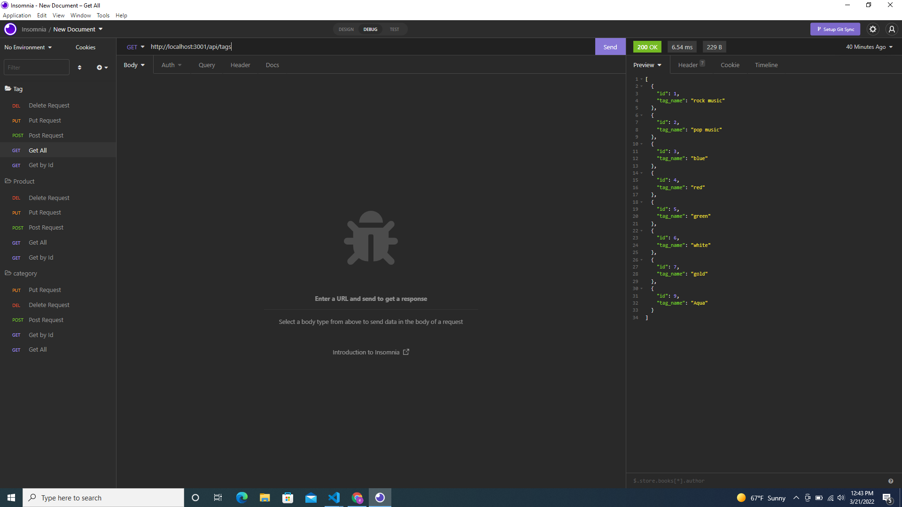

# egghead-engine

## Description

1. This application has an .env file so that information is not exposed and will connect to Sequelize without any problems.
2. As seen in video when commands for the schema and seeds files are entered then a database is created.
3. When the command to start the application is entered into the command line then everything starts as it should.
4. GET routes in Insomnia for categories, products, or tags will display formatted JSON.
5. POST, PUT, and DELETE routes in Insomnia will create, update, and delete information when used.

---

## Table of content

* [Description](#description)

* [Usage](#usage)

* [How to Contribute](#how-to-contribute)

* [Links](#links)

* [Questions](#questions)

---

## Usage

Backend database for e-commerce company. 

## How to Contribute

Pull requests. Feel free to open a pull requst on my GitHub.

## Questions

If you have nay questions about this project then you can contact me directly at 

liz@durableprogramming.com

----

## Links

[GitHub Repo](https://github.com/elizabethdberube/egghead-engine) 

[Walkthrough Video](https://drive.google.com/file/d/1l1zZpQ99ezGIWS6IskYy2HbAu0jou6j6/view) 

